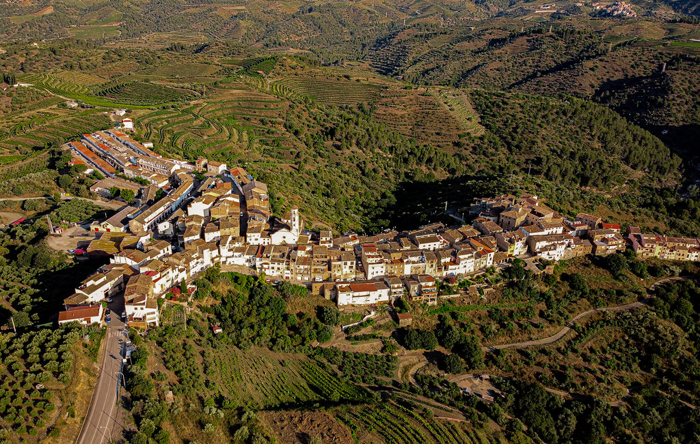

# Routes through the Priorat
  Mapa de rutes per carretera per la comarca catalana del Priorat. 
  Es mostra els trams de les rutes, punts d'interés i opinions de restaurants

  

  Link a la pàgina web: [link](file:///C:/Users/Sim%C3%B3n%20Becerra%20Tom%C3%A1s/Documents/GitHub/my-first-map/index.html#18/41.10263/1.14813)

## Tema
  El tema escollit per a la pàgina web ha estat rutes per carretera per el Priorat 
  per motivació personal. El Priorat es una comarca aillada del turisme de mases 
  que dona lloc a les massificacions esdevingudes tots els estius a les platges 
  de Salou, Tarragona. Un indret de baixa muntanya oplert de petits pobles i terres agrícoles 
  i boscos frondosos típics de clima mediterrani connectat per múltiples carreteres 
  de corbes, distribuits en un mosaic paisatgistic digne de patrimoni de la humanitat.
  
## Dades

## Estructura

## Web

## Cartografia

## Dificultats
